### RF-05 — Busca de livros por título/autor

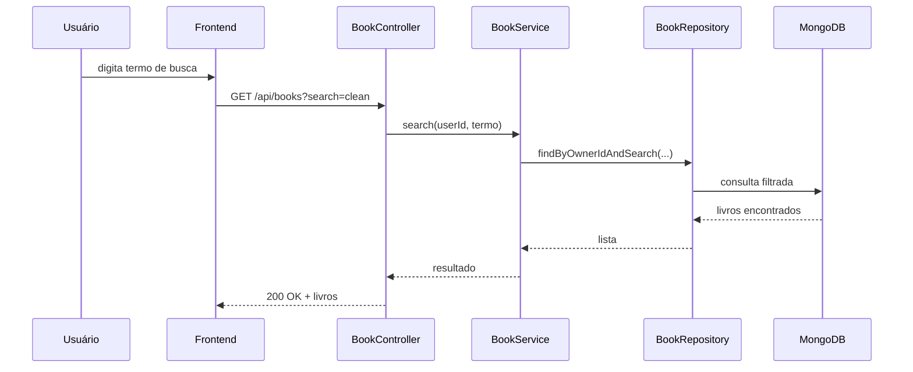

### RF-06 — Cadastro de usuário

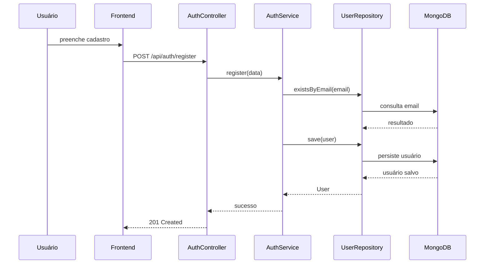

### RF-08 — Validação de e-mail único

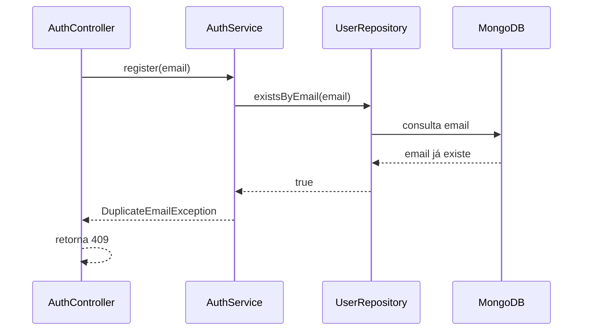

### RF-09 — Validação de e-mail

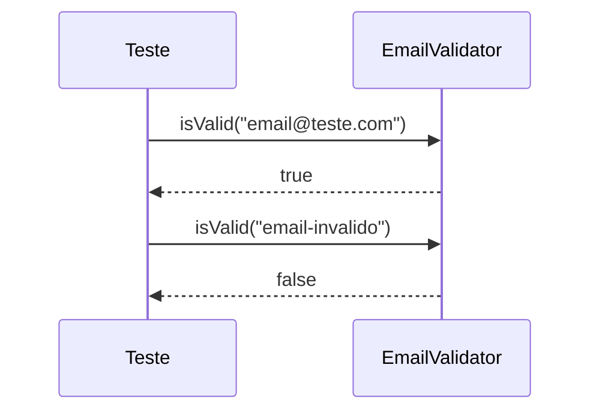

### RF-10 — Política de senha forte

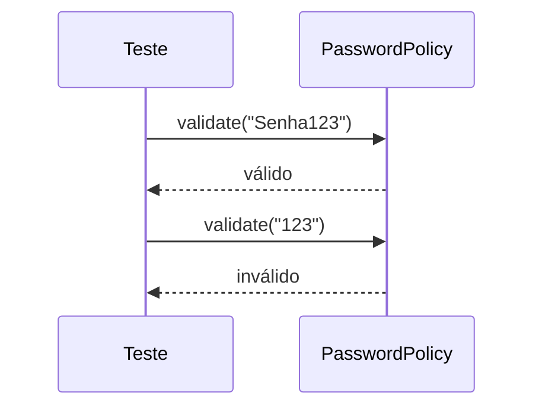

### RF-11 — Rejeição de senha fraca

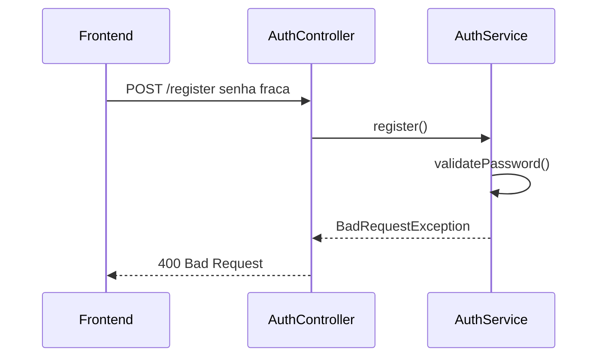

### RF-12 — Bloqueio sem autenticação JWT

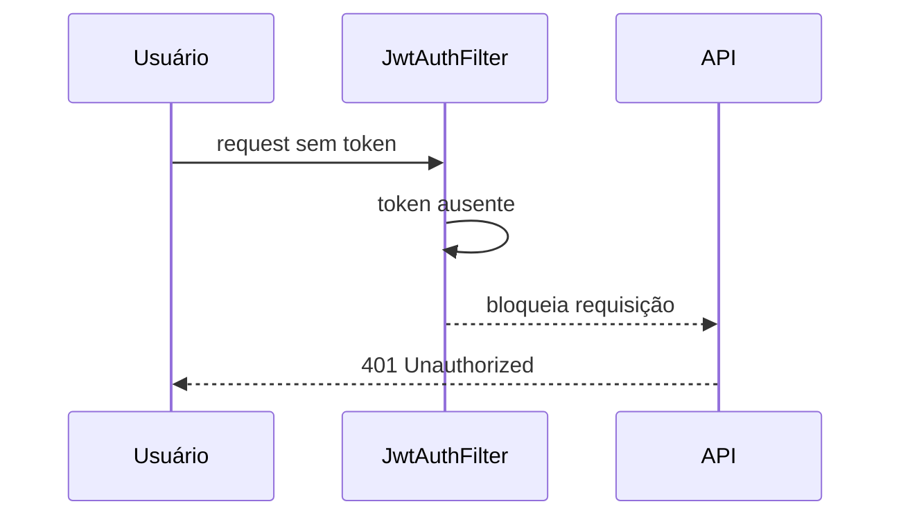

### RF-14 — Geração e validação JWT

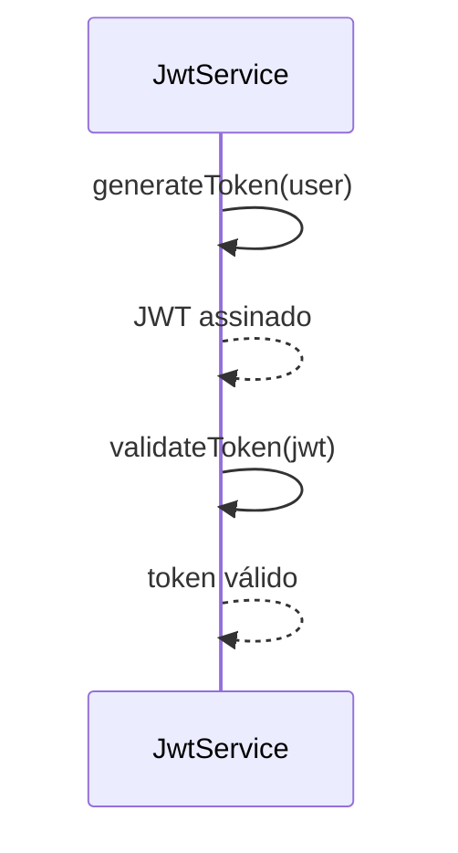

### RF-16 — CEP inexistente

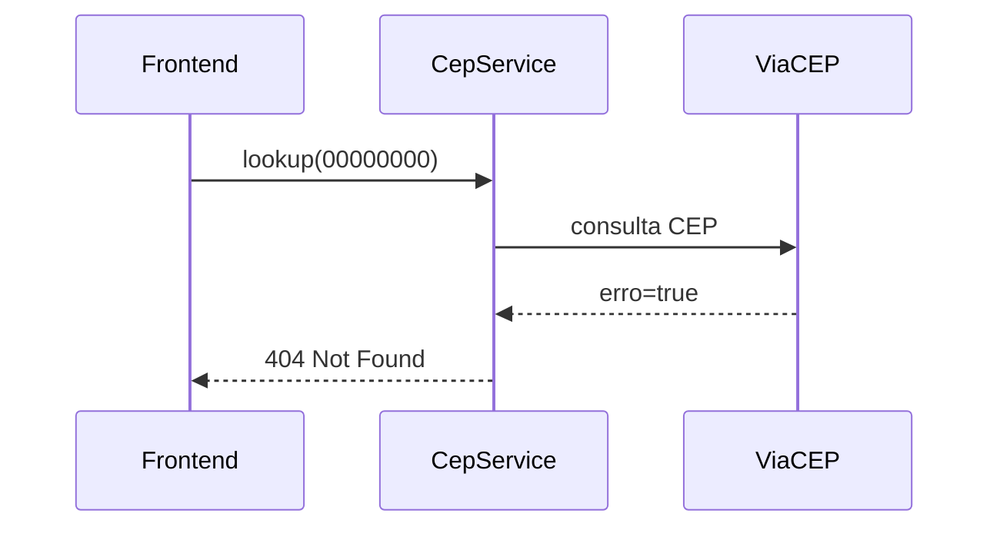

### RF-17 — CEP inválido

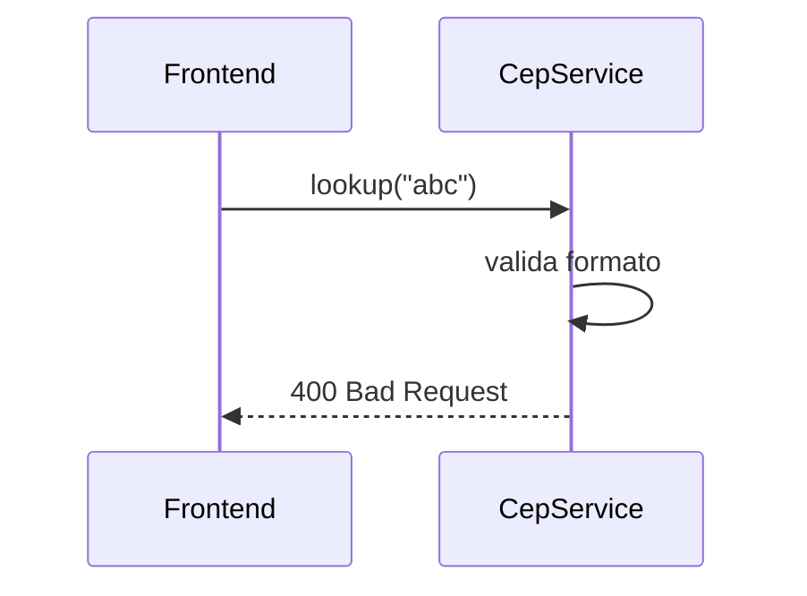

### RF-18 — Atualização de perfil

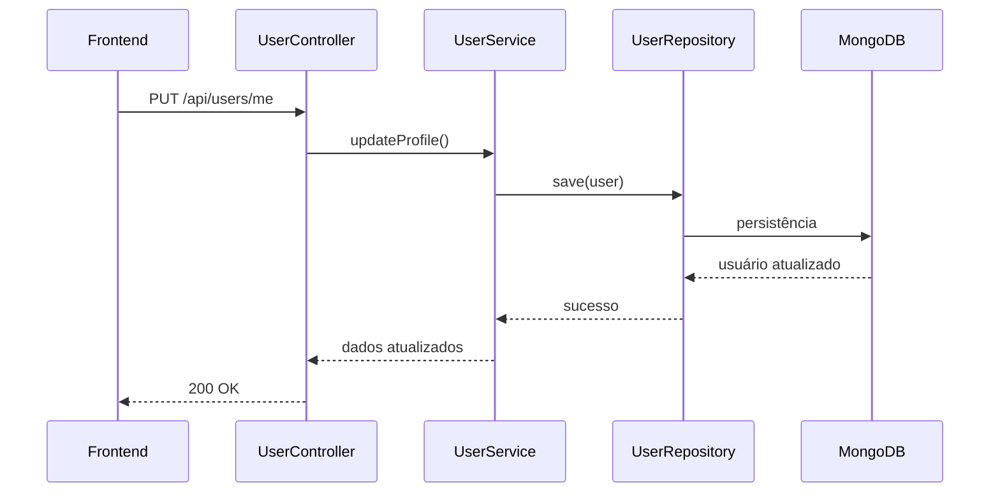