# RTM - Matriz de Rastreabilidade de Requisitos

| ID | Requisito Funcional | Camada | Teste(s) automatizado(s) | Tipo de teste |
|---|---|---|---|---|
| RF-01 | Cadastrar livro | `BookController.create` | `BookControllerIT#crudFullCycle` | Integração / Caixa Preta / Testcontainers |
| RF-02 | Listar livros do usuário | `BookController.list` | `BookControllerIT#crudFullCycle` | Integração / Caixa Preta |
| RF-03 | Editar livro | `BookController.update` | `BookControllerIT#crudFullCycle` | Integração / Caixa Preta |
| RF-04 | Excluir livro | `BookController.delete` | `BookControllerIT#crudFullCycle` | Integração / Caixa Preta |
| RF-05 | Buscar livros por título/autor | `BookController.list(search)` | `BookControllerIT#searchFiltersByTitleOrAuthor` | Integração / E2E |
| RF-06 | Cadastro de usuário | `AuthController.register` | `AuthControllerIT#registerThenLoginReturnsJwt` | Integração / Testcontainers |
| RF-07 | Login com JWT | `AuthController.login` | `AuthControllerIT#registerThenLoginReturnsJwt` | Integração / E2E |
| RF-08 | E-mail único no cadastro | `AuthService.register` | `AuthControllerIT#duplicateEmailReturns409` | Integração |
| RF-09 | Validação de e-mail | `EmailValidator` | `EmailValidatorTest` | Unitário Parametrizado / Caixa Branca |
| RF-10 | Política de senha forte | `PasswordPolicy` | `PasswordPolicyTest` | Unitário Parametrizado / Caixa Branca |
| RF-11 | Senha fraca rejeitada no cadastro | `AuthService.register` | `AuthControllerIT#invalidPasswordReturns400` | Integração |
| RF-12 | Filtro JWT bloqueia acessos não autenticados | `SecurityConfig` + `JwtAuthFilter` | `BookControllerIT#unauthenticatedRequestReturns401` | Integração / Segurança |
| RF-13 | Usuário só acessa os próprios livros | `BookService.getOwned` | `BookControllerIT#cannotAccessOtherUsersBook` | Integração / Caixa Preta |
| RF-14 | Geração/validação de token JWT | `JwtService` | `JwtServiceTest` | Unitário / Caixa Branca |
| RF-15 | Consulta de CEP (ViaCEP) | `CepService.lookup` | `CepServiceVcrTest#buscaCepValidoRetornaEndereco` | Integração API externa / WireMock / VCR |
| RF-16 | CEP inexistente retorna 404 | `CepService.lookup` | `CepServiceVcrTest#cepInexistenteLanca404` | VCR / Caixa Preta |
| RF-17 | CEP em formato inválido rejeitado | `CepService.lookup` | `CepServiceVcrTest#cepFormatoInvalidoLancaBadRequest` | Unitário / Validação |
| RF-18 | Editar perfil e endereço | `UserController.updateMe` | `AuthControllerIT` | Integração |

> Regra crítica do edital: **proibido o uso de Mockito/`@MockBean`**. Toda integração roda contra MongoDB real via **Testcontainers**, e a integração com ViaCEP usa **WireMock + JSON gravado (VCR)**.

---

# Diagramas de Sequência UML

## RF-01 — Cadastrar livro

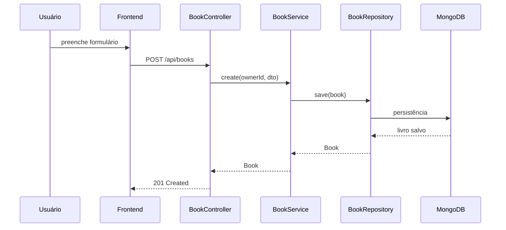

## RF-02 — Listar livros

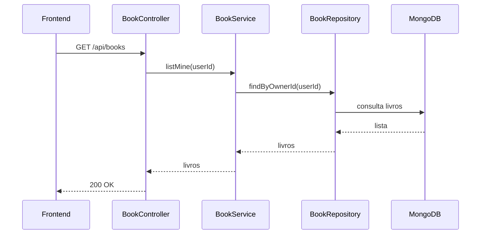

## RF-03 — Editar livro

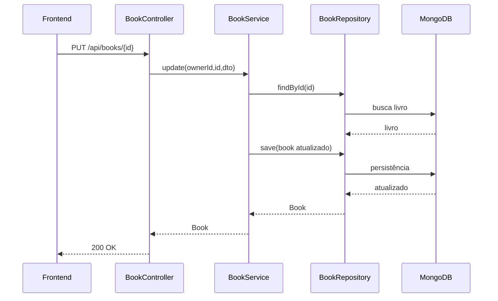

## RF-04 — Excluir livro

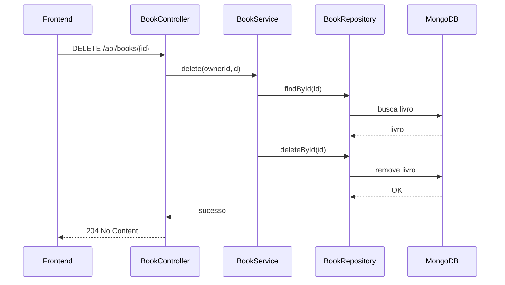

## RF-05 — Busca de livros por título/autor

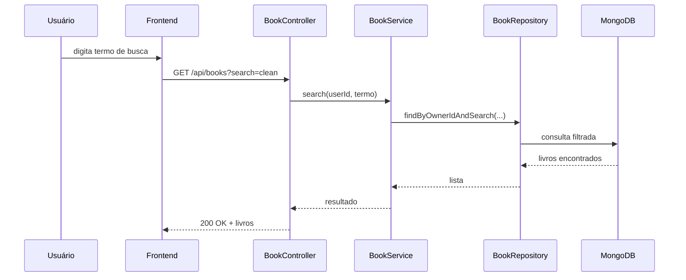

## RF-06 — Cadastro de usuário

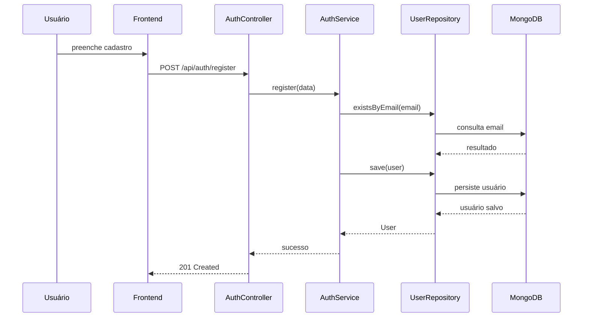

## RF-07 — Login com JWT

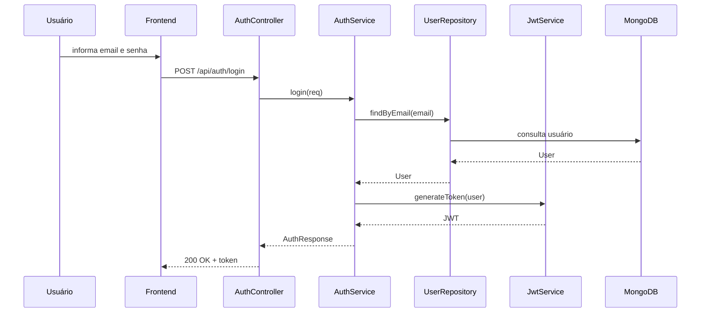

## RF-08 — Validação de e-mail único

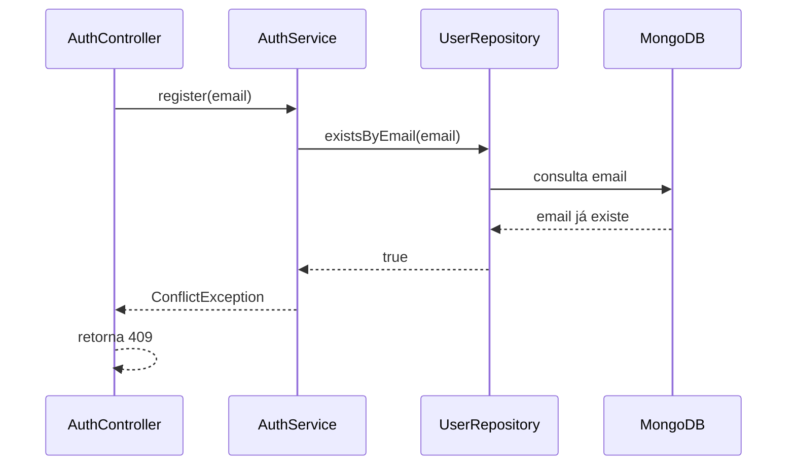

## RF-09 — Validação de e-mail

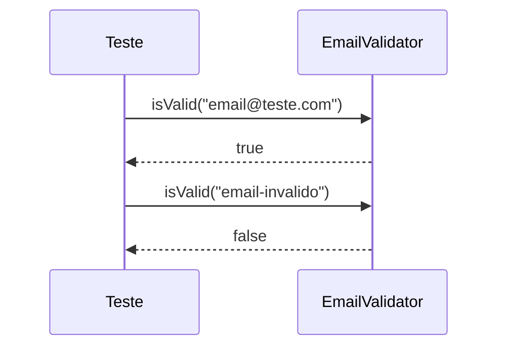

## RF-10 — Política de senha forte

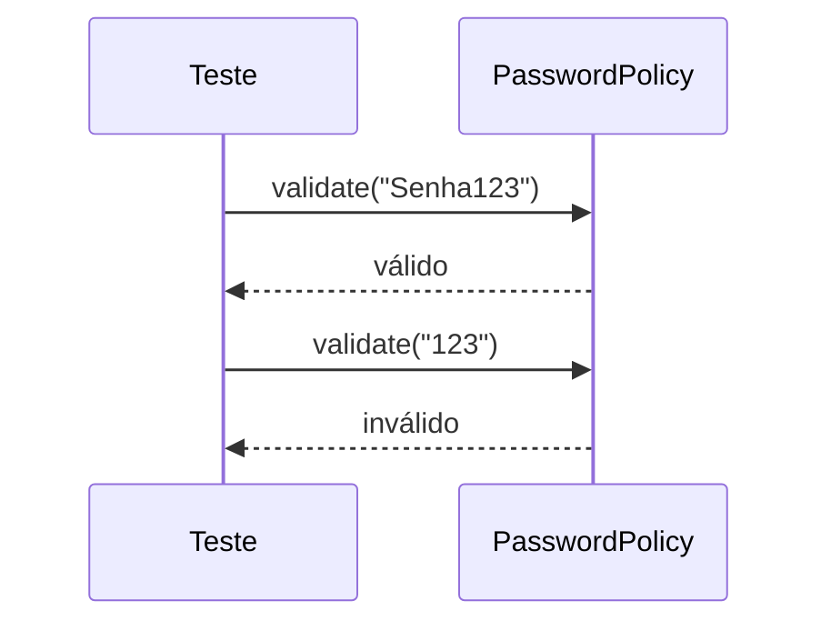

## RF-11 — Rejeição de senha fraca

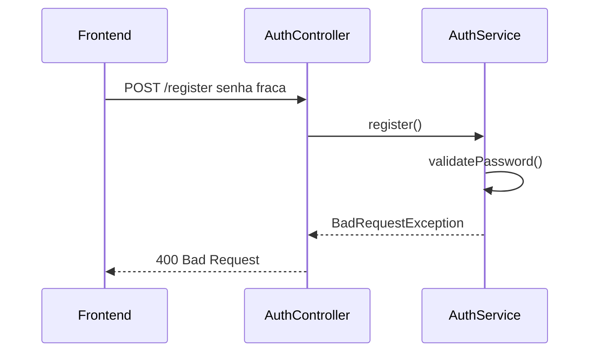

## RF-12 — Bloqueio sem autenticação JWT

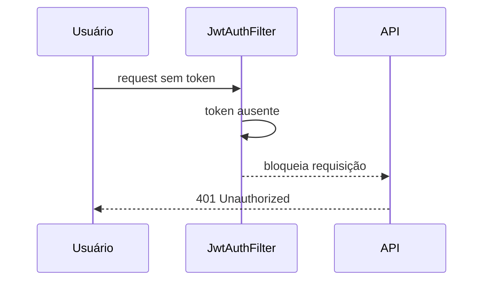

## RF-13 — Usuário só acessa os próprios livros

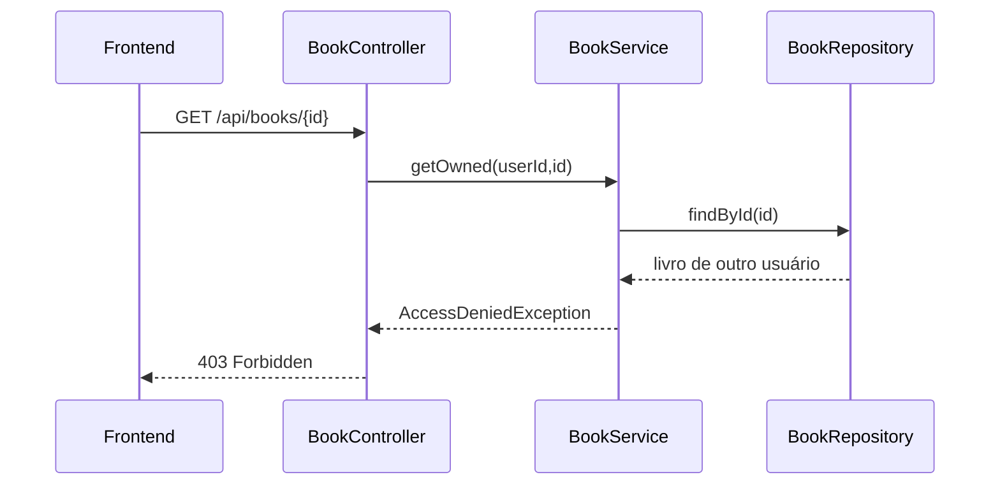

## RF-14 — Geração e validação JWT

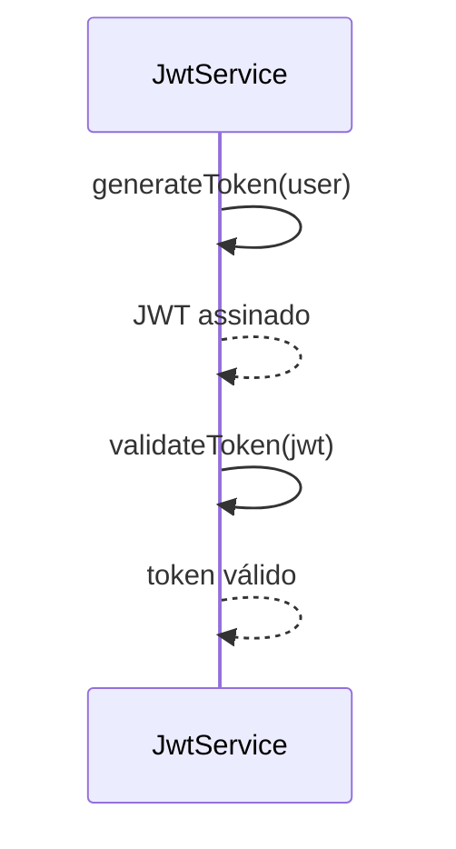

## RF-15 — Consulta de CEP

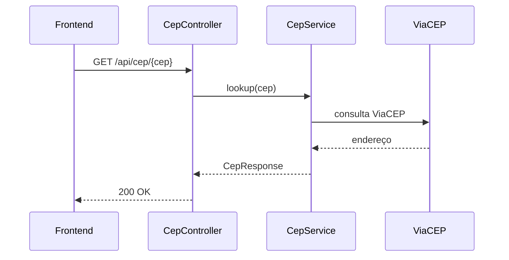

## RF-16 — CEP inexistente

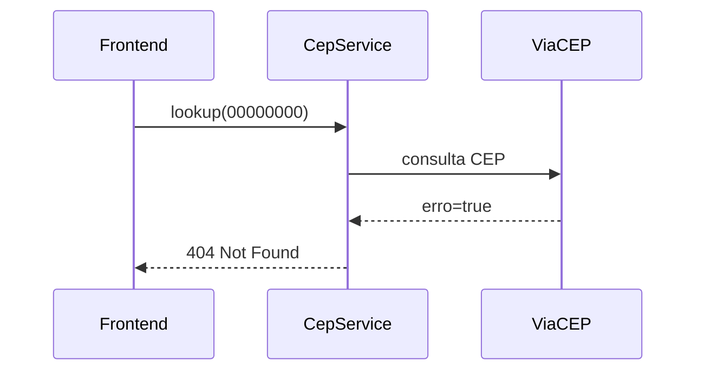

## RF-17 — CEP inválido

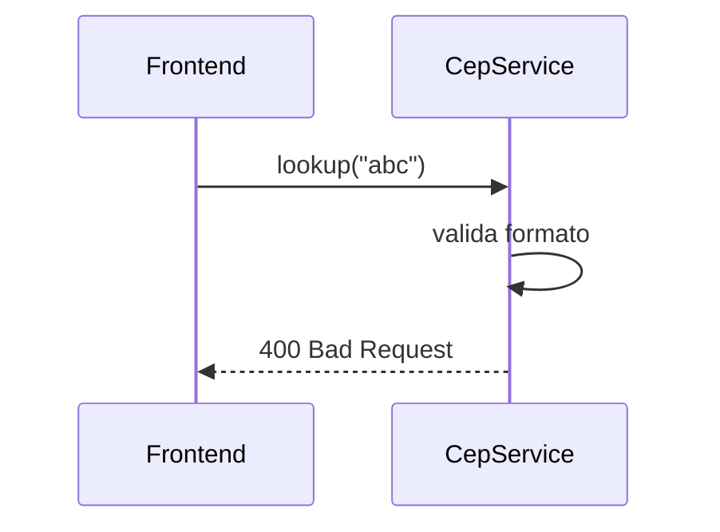

## RF-18 — Atualização de perfil

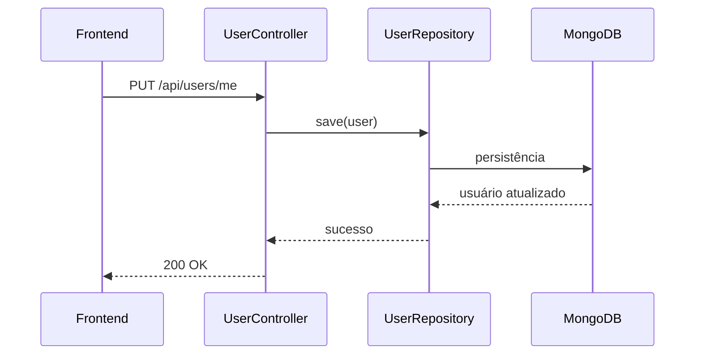